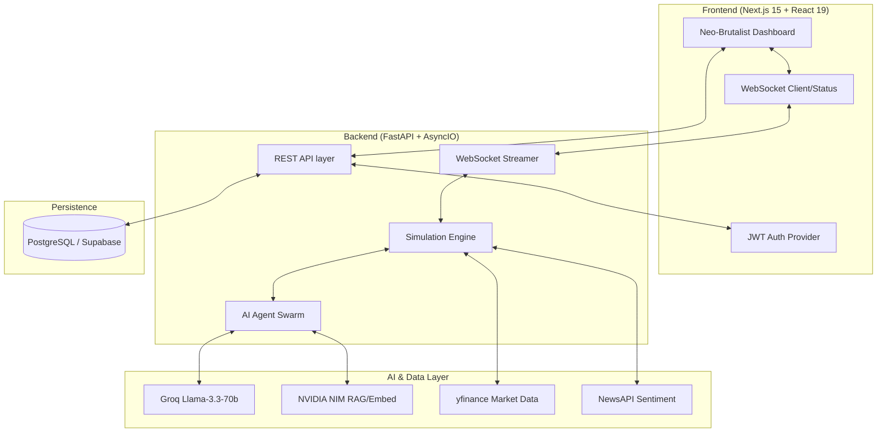

# StockMind — AI Market Sentiment War Room ⚡


> **StockMind** is a neo-brutalist, full-stack AI-powered application that simulates complex market movements by orchestrating thousands of autonomous LLM agents. It's designed to model real-world scenarios, from "Bull Runs" to "Panic Crashes," providing a high-fidelity "War Room" for sentiment analysis and market strategy testing.

---

## 🏗️ System Architecture

StockMind is built on a highly decoupled, async-first architecture designed for high throughput and real-time visualization.

### High-Level Data Flow



### 🧠 Agent Swarm Intelligence
The heart of StockMind is its multi-agent system. Each agent type has unique capital, risk tolerance, and decision-making logic:

| Agent Type | Strategy | Risk Profile | Primary Goal |
| :--- | :--- | :--- | :--- |
| **Hedge Fund** | Quantitative / Arbitrage | High (0.8) | Maximize alpha through complex options & timing. |
| **Retail Trader** | Emotional / Momentum | Low (0.3) | Herding behavior driven by FOMO and panic. |
| **News Agent** | Information Broker | N/A | Classify and broadcast sentiment from real-time feeds. |
| **Market Maker** | Delta Neutral / Spread | Med (0.2) | Provide liquidity and maintain tight bid/ask spreads. |
| **Regulator** | Market Stability | N/A | Enforce circuit breakers (20% price move halts). |

---

## 🚀 Key Features

- **Real-Time Simulation**: Watch thousands of agents trade in real-time via WebSockets.
- **Neo-Brutalist Aesthetic**: High-contrast dark mode with electric lime, purple, and pink accents.
- **Advanced RAG**: Uses NVIDIA NIM (`nv-embedqa-e5-v5`) searching historical market events to inform agent decisions.
- **Scenario Testing**: Pre-configured scenarios: *Bull Run, Bear Crash, Meme Stock Frenzy, Flash Crash*.
- **Sentiment Analytics**: Real-time sentiment mapping and heatmaps driven by Groq LLM reasoning.
- **Secure by Design**: Full JWT authentication with token rotation and secure session management.

---

## 🖥️ Dashboard Visualization


---

## 🛠️ End-to-End Setup Guide

Follow these steps to get the full StockMind environment running locally.

### 0. Quick Start
For a step-by-step walkthrough, see our **[End-to-End Setup Guide](README_END_TO_END.md)**.

### 1. Prerequisites
- **Python 3.11+**
- **Node.js 18+** & **pnpm**
- **PostgreSQL** (or a Supabase project)
- **API Keys**:
  - [Groq AI](https://console.groq.com) (Llama-3.3-70b)
  - [NewsAPI](https://newsapi.org)
  - [NVIDIA NIM](https://build.nvidia.com) (Optional for RAG)

### 2. Backend Setup (FastAPI)
```bash
cd stockmind-backend

# Create and activate virtual environment
python -m venv venv
source venv/bin/activate # On Windows: venv\Scripts\activate

# Install dependencies
pip install -r requirements.txt

# Configure environment
cp .env.example .env
# Open .env and add your DATABASE_URL, GROQ_API_KEY, and JWT_SECRET

# Initialize the Database
python init_db.py

# Run the server
uvicorn main:app --reload --host 0.0.0.0 --port 8000
```
*Backend will be available at `http://localhost:8000` with Swagger docs at `/docs`.*

### 3. Frontend Setup (Next.js)
```bash
# In the root directory
cp .env.local.example .env.local
# Set NEXT_PUBLIC_API_URL=http://localhost:8000/api

# Install and start
pnpm install
pnpm dev
```
*Frontend will be available at `http://localhost:3000`.*

### 4. Verification Check
Run the integration test suite to ensure all systems are communicating correctly:
```bash
cd stockmind-backend
python test_integration.py
```

---

## 📂 Project Structure

```text
StockMind/
├── app/                  # Next.js 15 App Router (Frontend)
├── components/           # Core UI Components (React 19)
│   ├── charts/           # Recharts & Sentiment Maps
│   ├── dashboard/        # War Room Zone Layouts
├── stockmind-backend/    # FastAPI Application (Backend)
│   ├── agents/           # LLM Agent Logic & AI Swarm
│   ├── simulation/       # Tick Engine & Orchestration
│   ├── data/             # yfinance & News Integration
│   ├── models/           # SQLAlchemy & Pydantic Schemas
│   ├── api/              # Auth & Simulation Routes
├── lib/                  # Auth Hooks & Utility Functions
├── public/               # Static Assets & Icons
```

---

## 📈 Technical Stack

- **Frontend**: Next.js 15, React 19, Tailwind CSS v4, Framer Motion, Recharts.
- **Backend**: Python 3.12, FastAPI, SQLAlchemy 2.0 (Async), Groq LLM.
- **AI/ML**: NVIDIA NIM, Llama-3.3-70b, SentenceTransformers.
- **Infrastructure**: WebSockets (Real-time), PostgreSQL/Supabase, Docker.

---

## 📄 License
StockMind is licensed under the [MIT License](LICENSE). 

---
⚡ **Built for the future of agentic trading systems.**
